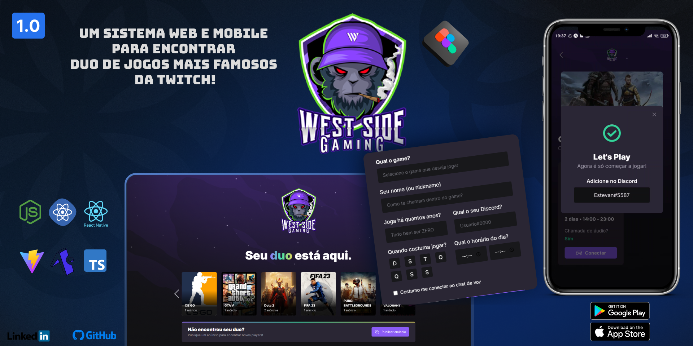

<p align="center">
      
</p>

<h1 align="center">[NLW eSports] Mission: Ignite</h1>

- ✅ Abertura – O Início da Missão
- ✅ Stage 1 - Base Building
- ✅ Stage 2 - High Speed
- ✅ Stage 3 - To be continued
- ✅ Stage 4 - Power up 
- ✅ Stage 5 – Final Round
---

<h2 align="center">Tópicos 📋</h2>

   <p>
   
   - [Sobre 📖](#sobre-)
   - [Layout 🎨](#layout-)
   - [Tecnologias 🛠️](#Tecnologias-)
   - [Arquivos no Notion 📋](#arquivo-no-notion-)
   - [Como Contribuir 💪](#como-contribuir-)
   - [Licença 📝](#licença-)

   </p>

---

<h2 align="center">Sobre 📖</h2>
<p align="center">
   Esse projeto foi desenvolvido na Next Level Week eSports, em uma semana intensa de estudos, acompanhado de um projeto desenvolvido pela Rocketseat do dia 11 ao dia 18 de Setembro de 2022.<br>
   Essa aplicação consiste em um sistema Web e Mobile para encontrar dupla para jogar. <br>

</p>
 
---

<h2 align="center">Layout 🎨</h2>

   <p align="center">
      
   </p>

   <p align="center">
      O Layout desenvolvido por <a href="https://www.figma.com/@dieegosf">Diego Schell Fernandes</a>, para acessar no Figma:
   
   - <a href="https://www.figma.com/community/file/1150897317533332617">Missão Ignite</a> 🚀
   </p>

---   

<h2 align="center">Tecnologias 🛠️</h2>

   <p>

- [ReactJS](https://reactjs.org/)
- [TypeScript](https://www.typescriptlang.org)
- [TailWindCSS](https://tailwindcss.com)
- [React native](https://reactnative.dev/)
- [Expo](https://expo.dev/)
- [Prisma](https://www.prisma.io)

   </p>

---

<h2 align="center">Arquivo no Notion 📋</h2>

- [Missão Ignite](https://efficient-sloth-d85.notion.site/Ignite-18c1174738e54f1d8e742f794e210cd2) 🚀


---

<h2 align="center">Como Contribuir 💪</h2>

   ```
   - Fork o projeto 

   - Cria uma nova branch com suas mudanças:
   $ git checkout -b my-feature

   - Salve suas mudanças e crie uma mensagem de commit falando o que fez:
   $ git commit -m "feature: My new feature"

   - Envie suas mudanças:
   $ git push origin my-feature
   ```

---

<h2 align="center">Licença 📝</h2>

<p align="center">
   Este repositório está sob licença MIT. Você pode ver o arquivo <a href="https://github.com/ErickSilva2605/rocketseat-nlw-esports/blob/main/LICENSE">LICENSE</a> para mais detalhes.
</p><br>

---


   >Esse projeto foi desenvolvido por **[@Erick Augusto](https://www.linkedin.com/in/joao-victor-full-stack/)**, com os instrutores da **[Rocketseat](https://rocketseat.com.br/)**, na #NextLevelWeekESports.<br>
   Se isso te ajudou, dê uma ⭐, isso vai me ajudar também! 😉

---

<br>
<div align="center">

   [](https://www.linkedin.com/in/erick-augusto-silva/)

</div>